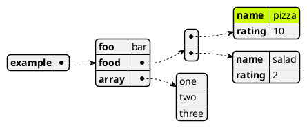
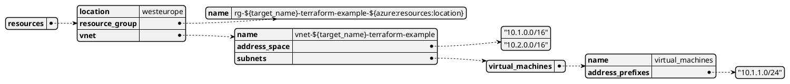
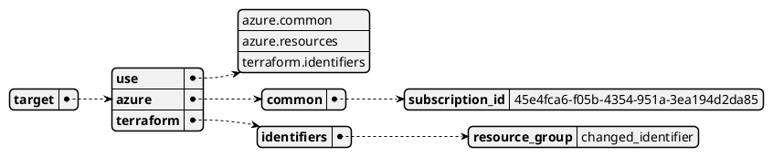

# Data

!!! note ""

    This datatype is heavily used within Skipper. Although it is exposed via the API, you will most likely not 
    have to work with it in the beginning.
    It may help to understand this core feature of Skipper though.

The [Data](https://pkg.go.dev/github.com/lukasjarosch/skipper#Data) type is the core datatype used throughout skipper.
It is the result of unmarshalling arbitrary yaml data and having the requirement to work with it in classes or targets.
In essence, it is just a `map[string]interface{}` with some attached functionality.
 

The functionality of the Data map is rather simple, yet powerful.
In essence, one can do the following:

- Get a value from the map using a [path](#Paths)
- Set a value given a [path](#Paths) 
- Merge two `Data` maps, following basic rules.
- Recursively find values

## Paths 
If you're familiar with [jq](https://github.com/stedolan/jq) or [yq](https://github.com/mikefarah/yq), then you already know what paths are.
Although, the paths in Skipper are not as powerful, they get the job done.

A path is a unique identifier of a specific value inside Skipper (say: a yaml file).

Instead of telling you how paths are created, let's consider the following example to show you.

```yaml title="Example yaml file"
---
example:
  foo: bar
  food:
    - name: "pizza" 
      rating: 10
    - name: "salad"
      rating: 2
  array:
    - one
    - two
    - three
```

In order to identify specific values inside this yaml file, the following paths could be used:

- `example.foo` points to **bar**
- `example.food.0.name` points to **pizza**
- `example.array.1` points to **two**

That's pretty much how paths work, there is not much more to know about them. 
Paths are just the plain identifiers and do not support any modifiers. They are only used to point to data which you're interested in.

These paths are what enables the use of variables, calls and secrets by uniquely identifying a specific value inside your inventory.


## Get and Set values
Getting and setting values inside `Data` is obviously required.
It leverages the [paths](#paths) to reference inside the map.




## Merge
## Find values

<!--
Visualization of `examples/terraform_azure/classes/azure/resources.yaml`


Visualization of `examples/terraform_azure/targets/develop.yaml`

```plantuml
@startjson
#highlight "Inventory" / "azure" / "resources"
#highlight "Inventory" / "azure" / "resources" / "location"
#highlight "Inventory" / "azure" / "resources" / "resource_group"
#highlight "Inventory" / "azure" / "resources" / "resource_group" / "name"
#highlight "Inventory" / "azure" / "resources" / "vnet"
#highlight "Inventory" / "azure" / "resources" / "vnet" / "address_space"
#highlight "Inventory" / "azure" / "resources" / "vnet" / "address_space" / "10.1.0.0/16"
#highlight "Inventory" / "azure" / "resources" / "vnet" / "address_space" / "10.2.0.0/16"
#highlight "Inventory" / "azure" / "resources" / "vnet" / "name"
#highlight "Inventory" / "azure" / "resources" / "vnet" / "subnets"
#highlight "Inventory" / "azure" / "resources" / "vnet" / "subnets" / "virtual_machines"
#highlight "Inventory" / "azure" / "resources" / "vnet" / "subnets" / "virtual_machines" / "address_prefixes"
#highlight "Inventory" / "azure" / "resources" / "vnet" / "subnets" / "virtual_machines" / "address_prefixes" / "1"
#highlight "Inventory" / "azure" / "resources" / "vnet" / "subnets" / "virtual_machines" / "name"
{
  "Inventory": {
    "azure": {
      "common": {
        "subscription_id": "45e4fca6-f05b-4354-951a-3ea194d2da85"
      },
      "resources": {
        "location": "westeurope",
        "resource_group": {
          "name": "rg-develop-terraform-example-westeurope"
        },
        "vnet": {
          "address_space": [
            "10.1.0.0/16",
            "10.2.0.0/16"
          ],
          "name": "vnet-develop-terraform-example",
          "subnets": {
            "virtual_machines": {
              "address_prefixes": [
                "10.1.1.0/24"
              ],
              "name": "virtual_machines"
            }
          }
        }
      }
    },
    "target": {
      "use": [
        "azure.resources",
        "azure.common",
        "terraform.identifiers"
      ]
    },
    "terraform": {
      "identifiers": {
        "resource_group": "changed_identifier",
        "subnets": {
          "virtual_machines": "vms"
        },
        "vnet": "vnet"
      }
    }
  },
  "TargetName": "develop"
}
@endjson
```



-->
