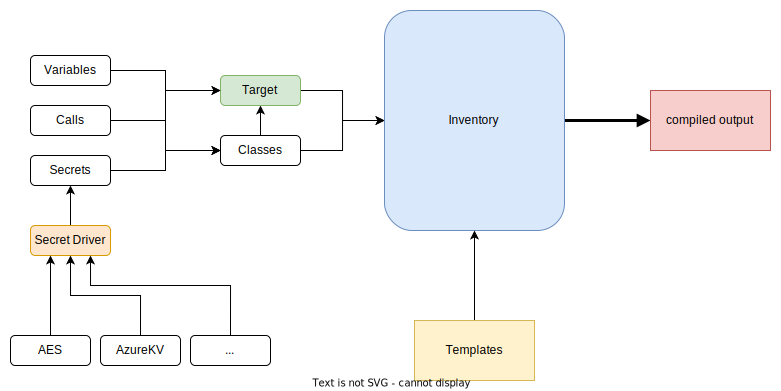

# Overview

The inventory is the core of every Skipper project. It is basically just a set of user-defined `yaml` files with some special rules attached.
These yaml files can be composed in order to produce a final inventory which you can use inside [templates](../templates/overview.md) to compile your desired target infrastructure.

Below is an overview of all the components which make up Skipper, and how they might interact with one-another.

## [Classes](./classes.md)
Classes are YAML files in which you can define information about every aspect of your project.
Classes become your building blocks, your source of truth and therefore the heart of your project.

## [Targets](./targets.md)
A target represents an instance of your project. Targets are defined with YAML files as well.
They use skipper-keywords to *include* classes which are relevant for that instance.
The combination of the used classes and what is defined inside a target, is the data you can use inside templates.

## [Variables](./variables/overview.md)
Variables are used to reference values inside your inventory.
Once data is formalized in classes, you can reference that data from other classes without the need
to redefine it. Connecting your data through variables is a very powerful way to represent business rules 
and makes refactoring a bliss.

## [Calls](./calls.md)
Sometimes the data you have needs to be transformed before it becomes useful inside templates.
With calls you can modify the data before it reaches the templates.
Maybe a specific value cannot be hardcoded into classes, then it might be useful to load it from an environment variable for example.

## [Secrets](../secrets/overview.md)
Secret management should not be a pain. Ideally secrets are also versioned along your inventory.
But storing secrets inside git is bad practice you say? 
Not with Skipper's secret management. Secrets are encrypted files which you can simply commit.
Only once the secrets are actually needed (e.g. inside a CI job), they are decrypted temporarily.

## [Templates](../templates/overview.md)
Templates (Skipper is using [go templates](https://pkg.go.dev/text/template)) have access to your target and classes.
You can build generic templates and aggregate your data into it, without having to re-write files for different stages.
Having a documentation, specific to an instance (stage) of your project, can be quite useful and is easy to implement with Skipper.
